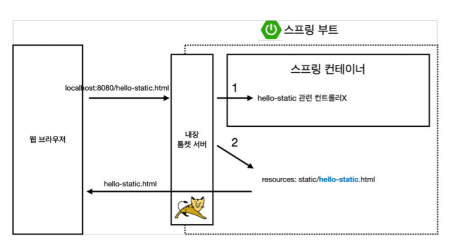
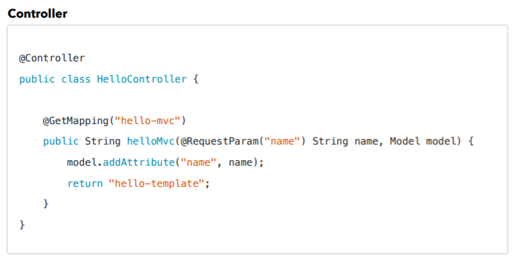
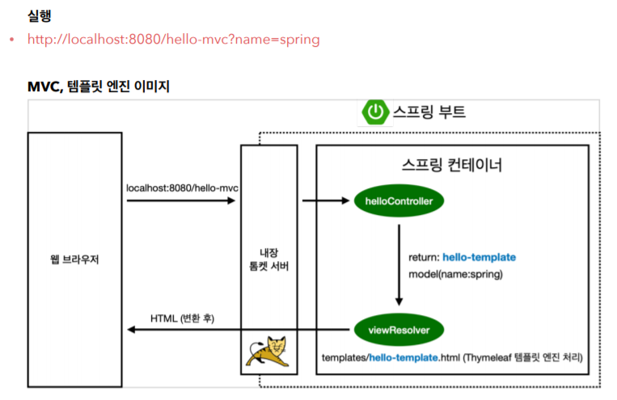
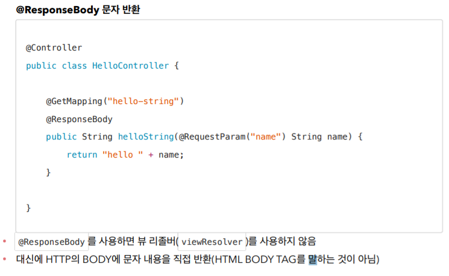
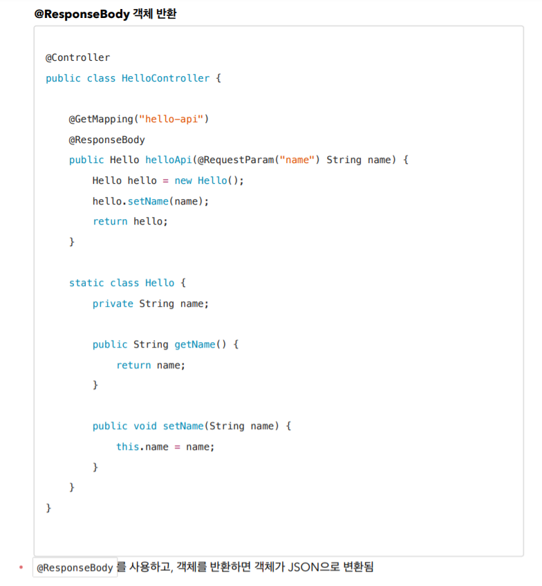
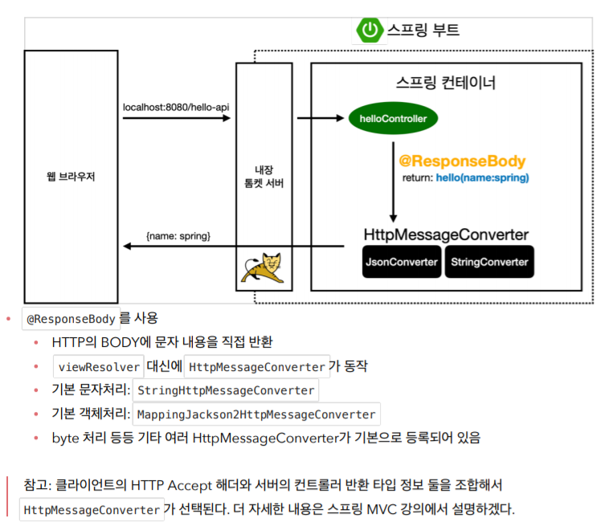

정적 컨텐츠
-----------------
* 파일을 그대로 웹프라우저에 내려줌



1. hello-static.html 을 치면 내장 톰켓 서버가 요청을 받음
2. hello-static 컨트롤러가 있는지 찾아봄
3. 없으면 내부 resources/static/hello-static.html을 찾음

- - -

MVC와 템플릿 엔진
----------------
* MVC : Model, View, Controller
* 템플릿 엔진을 모델 뷰 컨트롤러 방식으로 나눠서 뷰를 템플릿 엔진으로 html을 렌더링해서 클라이언트에게 전달


* @RequestParam : 웹 url로부터 파라미터를 받아와서 name변수에 저장 (기본 required는 true라 무조건 넣어야함)
* View (resources/template/hello-template.html)
  ```  
  <html xmlns:th="http://www.thymeleaf.org">
  <body>
  <p th:text="'hello ' + ${name}">hello! empty</p>
  </body>
  </html>
  ```



1. 내장 톰켓 서버를 거쳐 스프링에 hello-mvc가 왔다고 던짐
2. 스프링이 맵핑된 컨트롤러 메소드를 찾아 호출
3. 리턴된 값을 사용해 viewResolver가 화면 연결 (템플릿 엔진 처리 요청함)


- - -

API
-------------------------
* html을 사용하지 않고 데이터를 바로 내리는 방식
* 보통 객체를 반환하는 방식


* 실행 : http://localhost:8080/hello-spring?name=spring


* 컨트롤러가 객체를 리턴 (JSON으로 변환됨)
* 실행 : http://localhost:8080/hello-api?name=spring

* @ResponseBody 사용 원리


* 컨트롤러가 @ResponseBody 어노테이션이 있으면 http응답에 그대로 넘김(없으면 뷰리졸버한테 던짐)
* 객체가 반환이 되면 JSON방식으로 데이터를 만들어서 http응답에 반환
* HttpMessageConverter가 동작 : 문자는 StringConverter, 객체는 JsonConverter가 동작
