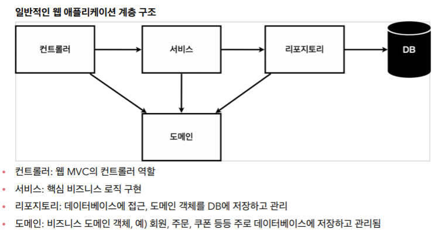

웹 어플리케이션 계층 구조
--------------------------

* 도메인 : 데이터베이스에 저장하고 관리되는 객체
* 리포지토리 : 도메인 저장소
- - -
#### 회원 리포지토리 인터페이스
    ```
    package hello.hellospring.repository;
    
    import hello.hellospring.domain.Member;
    import java.util.List;
    import java.util.Optional;
    
    public interface MemberRepository {
     Member save(Member member);
     Optional<Member> findById(Long id);
     Optional<Member> findByName(String name);
     List<Member> findAll();
    }
    ```
* Optional : 반환값이 null일 경우를 위해 Optional로 한번 감싸주는 방법
- - -
#### 그 후 리포지토리 메모리 구현체 작성
- - -
#### 리포지토리 테스트 케이스 작성
* 개발한 기능을 실행, 테스트 할때 자바는 JUnit 프레임워크로 테스트 실행
* src/test/java/하위폴더에 테스트파일 작성
* @Test 어노테이션을 붙이면 그냥 실행할 수 있음
* 모든 테스트는 순서 상관 없음
    * 테스트 하나 끝날 때마다 데이터를 클리어 해줘야함 (저장소, 공용데이터 등)
    * @AfterEach 붙은 함수를 테스트 하나 끝날 때마다 실행됨
- - -
#### 서비스 개발
* main/java/하위 폴더에 service패키지 생성
- - -
### 서비스 테스트
* @BeforeEach : 각 테스트 실행 전에 호출. 테스트가 서로 영향이 없도록 항상 새로운 객체를 생성하고, 의존관계도 새로 맺어준다.
* 여러 repository 객체가 생기는 것을 방지하기 위해 MemberService 생성자에 외부에서 repository를 넣어줌 --> dependency injection (DI)
