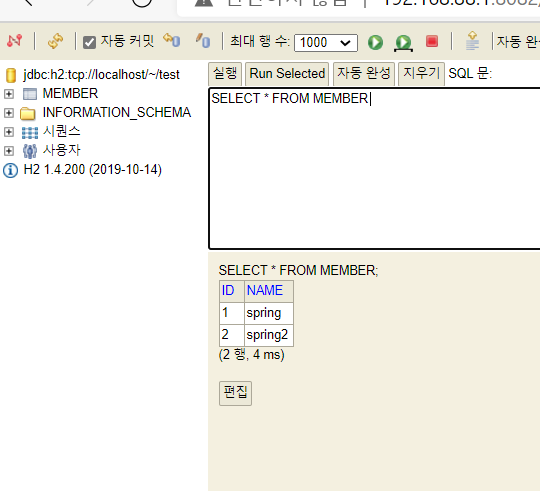

스프링 DB 접근 기술
======================
## 1. H2 데이터베이스 설치
* www.h2database.com
* 설치 경로 h2/bin/h2.sh 실행 (윈도우: h2입력)
* 데이터베이스 파일 생성 방법
  * 1. jdbc:h2:~/test (최초 한번)
  * 2. ~/test.mv.db 파일 생성 확인
  * 3. 이후 jdbc:h2:tcp://localhost/~/test 로 접속 (소켓을 통해 접속)
  
* 테이블 생성
  * h2 콘솔에 입력 (h2데이터베이스에 접근해 member테이블 생성)
    ```
    drop table if exists member CASCADE;
    create table member
    (
     id bigint generated by default as identity,
     name varchar(255),
     primary key (id)
    );
    ```
  * generated by default as identity : 값을 세팅하지 않으면 DB가 자동으로 id값 채워줌
  * 예시 : insert into member(name) values('spring')
  -> id는 1로 자동으로 들어가서 등록됨
  
  
- - -
## 2. JDBC
#### 환경설정
* build.gradle 파일에 jdbc, h2 데이터베이스 관련 라이브러리 추가
     ```
     implementation 'org.springframework.boot:spring-boot-starter-jdbc'
     runtimeOnly 'com.h2database:h2'
     ```
* 스프링부트 데이터베이스 연결 설정 추가 (resources/application.properties)
    ```
    spring.datasource.url=jdbc:h2:tcp://localhost/~/test
    spring.datasource.driver-class-name=org.h2.Driver
    spring.datasource.username=sa
    ```
* Jdbc 레포지토리 구현 (jdbc api 직접코딩, 참고만)
    * DataSource : 데이터베이스 커넥션을 획득할 때 사용하는 객체(스프링부트가 빈으로 만들어줌)
    
#### 스프링 통합 테스트
* 스프링 컨테이너와 DB까지 연결한 통합 테스트
* @SpringBootTest : 스프링 컨테이너와 테스트를 함께 실행
* @Transactional : 테스트 시작 전에 트랜잭션 시작, 완료 후에 롤백(이렇게 하면 DB에 데이터 안남음)
- - -
## 3. 스프링 JdbcTemplate
* 순수 jdbc와 동일 환경설정 (build.gradle)
* jdbc api 반복코드 대부분 제거, SQL은 직접 작성해야함
* 생성자가 하나일 땐 생성자에 @Autowired 생략해도 빈으로 만들어짐
* JdbcTemplateMemberRepository.java
- - -
## 4. JPA
* 반복 코드, SQL도 자동으로 처리해줌
#### (1) build.gradle 파일에 jpa 관련 라이브러리 추가
    ```
    implementation 'org.springframework.boot:spring-boot-starter-data-jpa'
    ```
#### (2) 스프링부트에 JPA 설정 추가 (resources/application.properties)
    ```
    spring.jpa.show-sql=true //jpa가 생성하는 sql을 출력한다. 
    spring.jpa.hibernate.ddl-auto=none //jpa의 테이블 자동생성기능 (create,none)
    ```
* JPA : 인터페이스, hibernate : 구현체

#### (3) JPA 엔티티 맵핑 (도메인)
* @Entity
* @Id 
* @GeneratedValue(strategy = GenerationType.IDENTITY) : DB가 id 자동으로 생성?

#### (4) JPA 회원 레퍼지토리
* JPA는 EntityManager로 모든 동작 수행
* build.gradle에 jpa라이브러리 implement 되어있으면 스프링부트가 자동으로 entitymanager 생성
* 인젝션 받으면 됨
* 여러 리스트를 돌리는 경우 jpql 작성해야함 ( findByName, findAll ..)

#### (5) 서비스 계층에 트랜잭션 추가
* @Transactional : 스프링은 해당 클래스 메소드를 실행할 때 트랜잭션 시작하고 정상 종료되면 트랜잭션을 커밋함, 예외가 발생하면 롤백
* JPA를 통한 모든 데이터 변경은 트랜잭션 안에서 실행해야함

- - -
## 스프링 데이터 JPA
