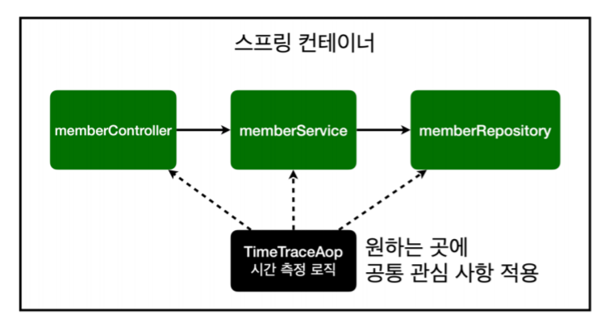

AOP
==================
* 모든 메소드의 호출 시간을 측정하고 싶을 때
* 회원 가입 시간, 회원 조회 시간을 측정하고 싶을 때
* AOP: Aspect Oriented Programming (관점 지향 프로그래밍)
* 공통 관심 사항(cross-cutting concern) vs 핵심 관심 사항(core concern) 분리

* @Aspect
* @Around("execution(* hello.hellospring..*(..))") : hellospring 패키지 하위에 있는 모든 것들 -> 원하는 적용 대상을 선택 가능
* 시간 측정하는 로직을 별도의 공통 로직으로 만듬

* 스프링 컨테이너가 AOP가 적용되야하면 프록시를 생성
* 프록시(가짜)를 통해 AOP기능이 먼저 실행이 되고 그 후 joinPoint.proceed()를 호출하면 진짜 기능을 실행한다.
